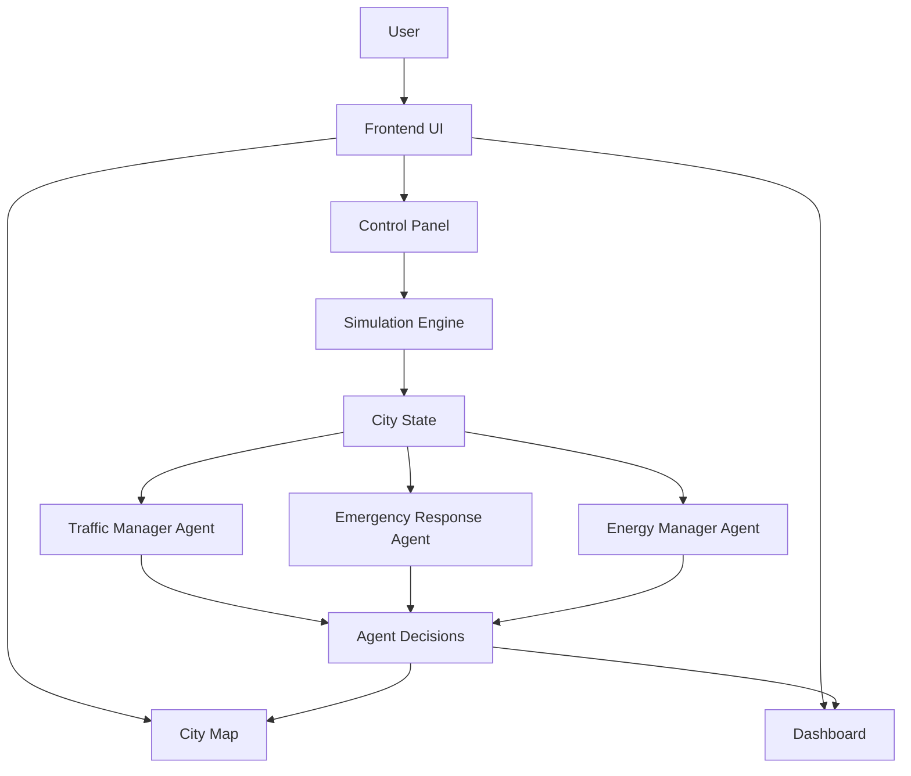

# Architecture

The Smart City Simulator uses a simple web architecture based on a React frontend, a simulation engine and multiple AI agents.

## Architecture diagram



## Main components

### Frontend UI

The frontend displays the simulated city and allows the user to interact with the simulation.

It includes:

- city map
- dashboard
- control panel
- visual representation of vehicles, roads, buildings and incidents

### Simulation Engine

The simulation engine updates the city state.

It handles:

- vehicle movement
- traffic density
- congestion detection
- incident generation
- incident resolution
- city status updates

### AI Agents

The project includes multiple AI agents that make automatic decisions based on the current state of the city.

#### Traffic Manager Agent

Responsibilities:

- analyzes road congestion
- detects traffic problems
- recommends traffic optimization decisions

#### Emergency Response Agent

Responsibilities:

- detects active incidents
- sends emergency response decisions
- requests priority for emergency situations

#### Energy Manager Agent

Responsibilities:

- monitors city energy usage
- identifies high energy usage situations
- recommends energy saving decisions

### City State

The city state contains the current simulation data.

It includes:

- roads
- vehicles
- buildings
- incidents
- traffic levels
- energy usage
- agent decisions

## Data flow

```text
User action
   |
Control Panel
   |
Simulation Engine
   |
Updated City State
   |
AI Agents analyze state
   |
Agent decisions
   |
Dashboard and City Map update
```