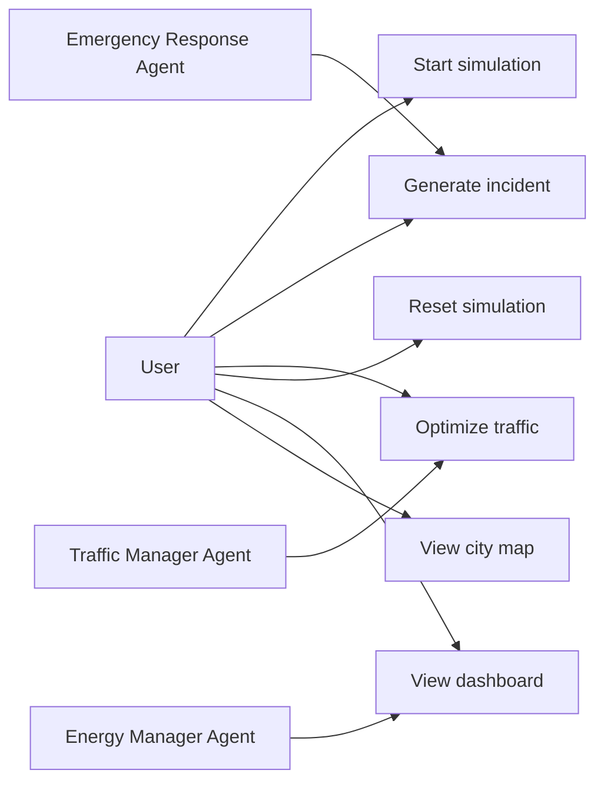
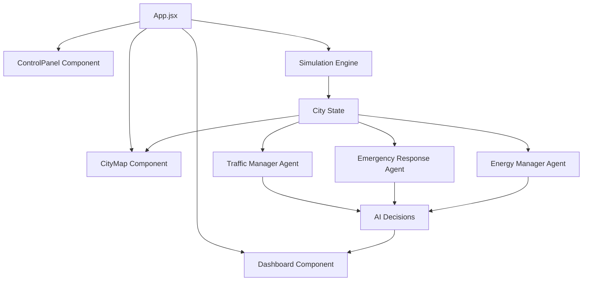
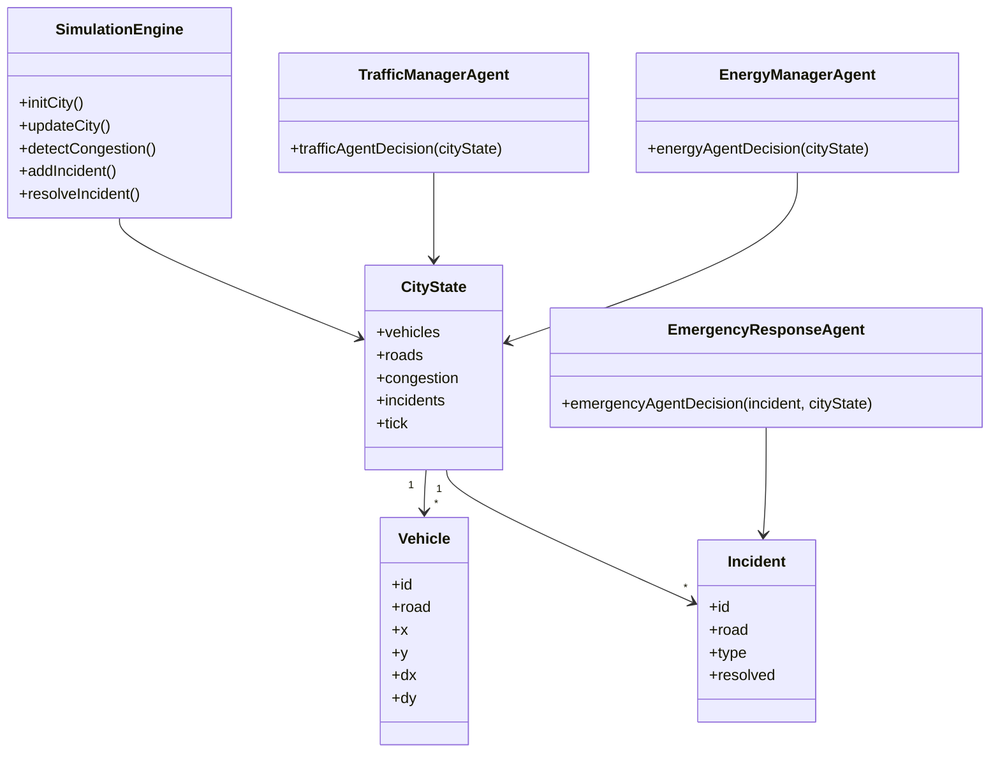
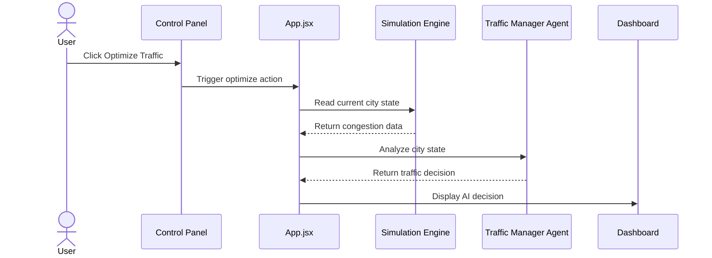
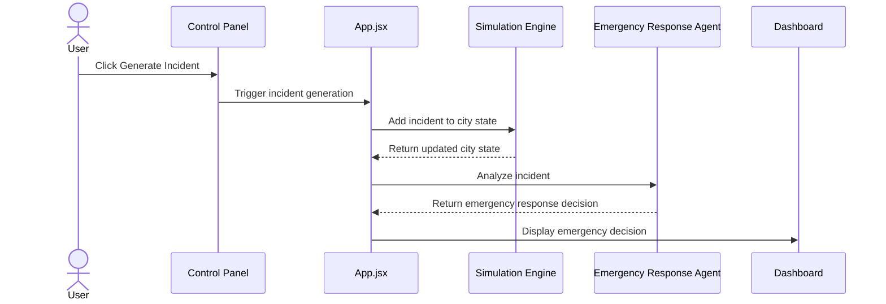

# UML Diagrams

This document contains UML-style diagrams for the Smart City Simulator project.

## Use Case Diagram

## Component Diagram

## Class Diagram

## Sequence Diagram: Traffic Optimization

## Sequence Diagram: Emergency Incident

